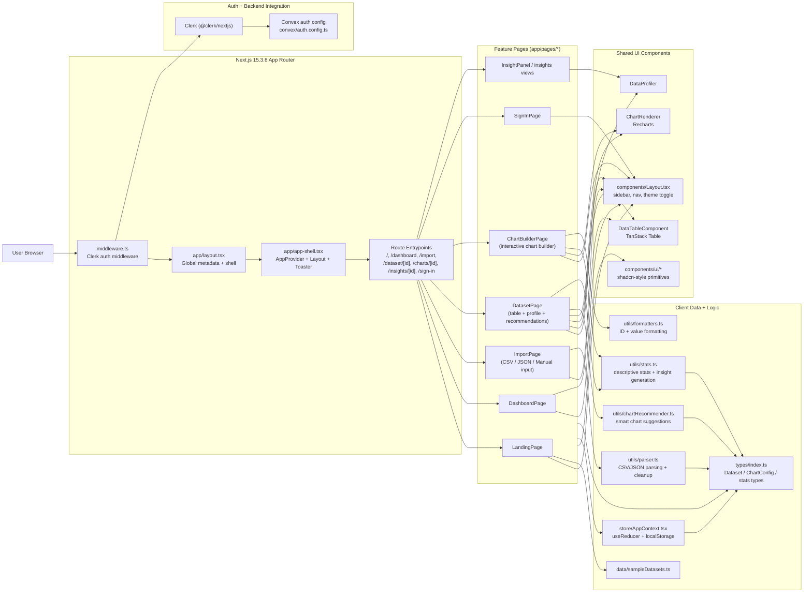
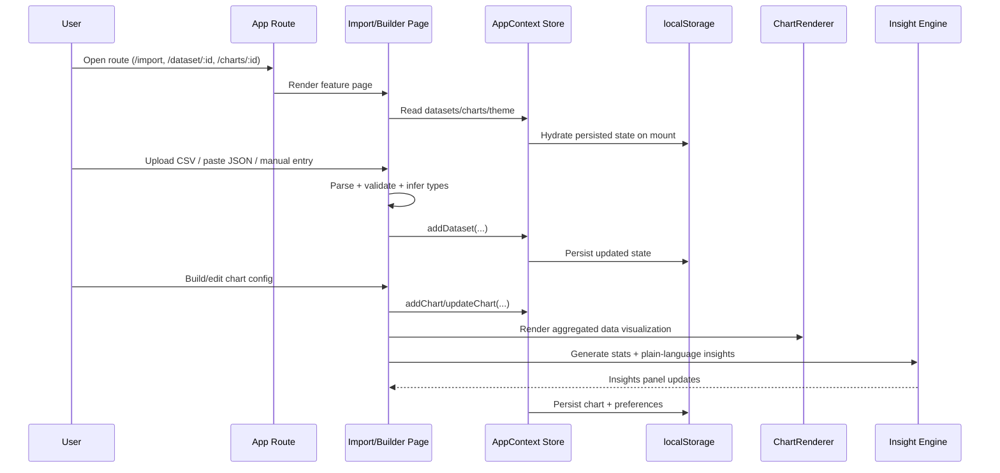

# DataViz Studio Architecture Diagram

This diagram is **Excalidraw-friendly** via Mermaid import.

## System Structure

```mermaid
flowchart LR
    User[User Browser]

    subgraph Next["Next.js 15.3.8 App Router"]
      Middleware["middleware.ts\nClerk auth middleware"]
      Layout["app/layout.tsx\nGlobal metadata + shell"]
      Shell["app/app-shell.tsx\nAppProvider + Layout + Toaster"]
      Routes["Route Entrypoints\n/, /dashboard, /import,\n/dataset/[id], /charts/[id], /insights/[id], /sign-in"]
    end

    subgraph Features["Feature Pages (app/pages/*)"]
      Landing["LandingPage"]
      Dashboard["DashboardPage"]
      ImportPage["ImportPage\n(CSV / JSON / Manual input)"]
      DatasetPage["DatasetPage\n(table + profile + recommendations)"]
      ChartBuilder["ChartBuilderPage\n(interactive chart builder)"]
      SignIn["SignInPage"]
      InsightsPage["InsightPanel / insights views"]
    end

    subgraph Shared["Shared UI Components"]
      MainLayout["components/Layout.tsx\nsidebar, nav, theme toggle"]
      DataTable["DataTableComponent\nTanStack Table"]
      Profiler["DataProfiler"]
      ChartRenderer["ChartRenderer\nRecharts"]
      UI["components/ui/*\nshadcn-style primitives"]
    end

    subgraph DataLayer["Client Data + Logic"]
      Store["store/AppContext.tsx\nuseReducer + localStorage"]
      Types["types/index.ts\nDataset / ChartConfig / stats types"]
      Parser["utils/parser.ts\nCSV/JSON parsing + cleanup"]
      Stats["utils/stats.ts\ndescriptive stats + insight generation"]
      Recommender["utils/chartRecommender.ts\nsmart chart suggestions"]
      Formatters["utils/formatters.ts\nID + value formatting"]
      Samples["data/sampleDatasets.ts"]
    end

    subgraph AuthAndBackend["Auth + Backend Integration"]
      Clerk["Clerk (@clerk/nextjs)"]
      Convex["Convex auth config\nconvex/auth.config.ts"]
    end

    User --> Middleware
    Middleware --> Layout
    Layout --> Shell
    Shell --> Routes

    Routes --> Landing
    Routes --> Dashboard
    Routes --> ImportPage
    Routes --> DatasetPage
    Routes --> ChartBuilder
    Routes --> SignIn
    Routes --> InsightsPage

    Landing --> MainLayout
    Dashboard --> MainLayout
    ImportPage --> MainLayout
    DatasetPage --> MainLayout
    ChartBuilder --> MainLayout
    SignIn --> MainLayout

    Dashboard --> DataTable
    DatasetPage --> DataTable
    DatasetPage --> Profiler
    DatasetPage --> ChartRenderer
    ChartBuilder --> ChartRenderer
    InsightsPage --> Profiler
    Features --> UI

    Features --> Store
    Features --> Types
    ImportPage --> Parser
    DatasetPage --> Recommender
    DatasetPage --> Stats
    ChartBuilder --> Stats
    ChartBuilder --> Formatters
    Landing --> Samples

    Store --> Types
    Parser --> Types
    Stats --> Types
    Recommender --> Types

    Middleware --> Clerk
    Clerk --> Convex
```

## Runtime Flow (How Parts Work Together)

```mermaid
sequenceDiagram
    participant U as User
    participant R as App Route
    participant P as Import/Builder Page
    participant S as AppContext Store
    participant L as localStorage
    participant C as ChartRenderer
    participant I as Insight Engine

    U->>R: Open route (/import, /dataset/:id, /charts/:id)
    R->>P: Render feature page
    P->>S: Read datasets/charts/theme
    S->>L: Hydrate persisted state on mount

    U->>P: Upload CSV / paste JSON / manual entry
    P->>P: Parse + validate + infer types
    P->>S: addDataset(...)
    S->>L: Persist updated state

    U->>P: Build/edit chart config
    P->>S: addChart/updateChart(...)
    P->>C: Render aggregated data visualization
    P->>I: Generate stats + plain-language insights
    I-->>P: Insights panel updates
    S->>L: Persist chart + preferences
```

